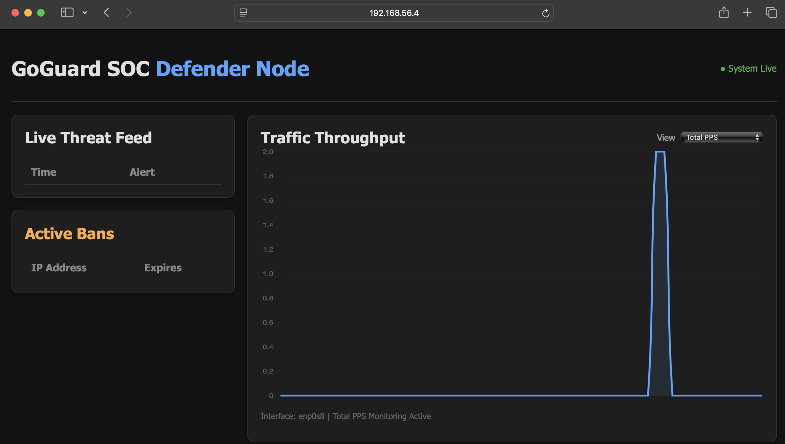
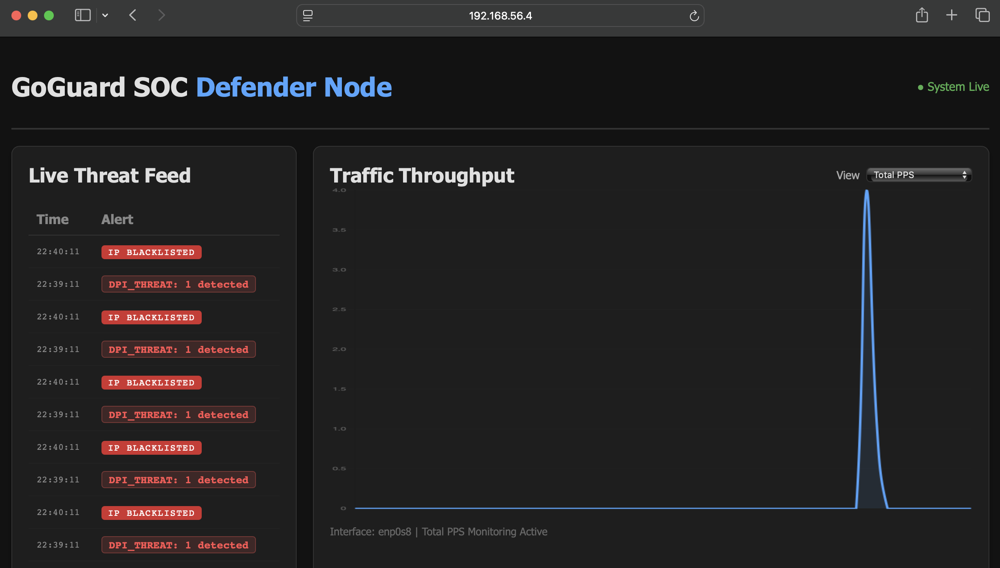
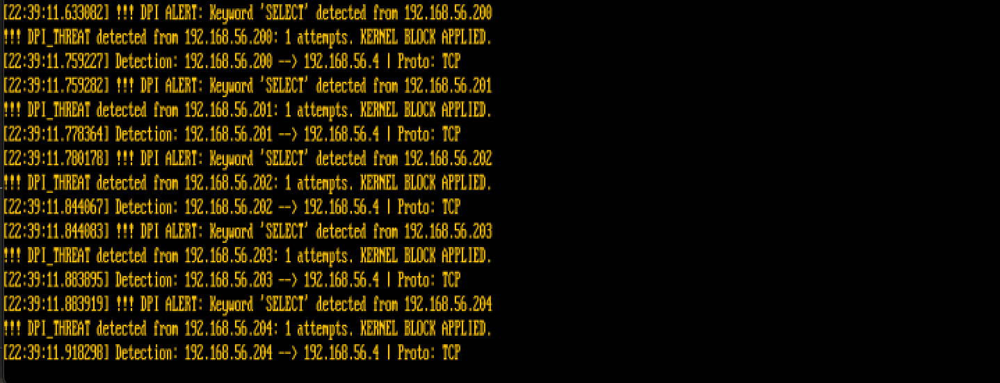

# Phase 2

# Red Team Attack Report

## 1. Executive Summary
The objective of this engagement was to evaluate the effectiveness of the GoGuard Intrusion Prevention System (IPS) in detecting and mitigating high-severity network attacks in real time. Two attacks scenarios were executed from an isolated Red Team virtual machine targeting the Blue Team's Ubuntu Server running goguard. 

- **Packet Fragmentation** scapy with split packets via `Python` script
- **IP Spoofing Attack** scapy with dangerous text via `Python` script

These attacks simulate realistic adversarial behavior attempting to bypass the Guard by deceiving the receivers. The evaluation focused on:
- Detection accuracy  
- Response time  
- Effectiveness of automated mitigation (iptables enforcement)

The evaluation focused on detection accuracy response time, and the effectiveness of automated mitigation via iptables enforcement. Both attacks were successfully identified and mitigated by the system. A critical gap was identified: while the banlist works as expected, the ban duration does not increment if an attacker continues to send packets while already banned. Additionally, active bans are lost upon system restart due to the lack of persistent storage.

| Attack Vector | Tool | Outcome | IPS Response |
|---|---|---|---|
| Packet Splitting | scapy | Malicious payload identified despite fragmentation | Detected + IP blocked |
| IP Spoofing | scapy | Detected `SELECT` in payload and identified true source | Detected + IP banned |
| Repeat Packet Flooding | `Python` socket | Initial ban correctly applied | Detected + IP banned |

---

## 2. Environment Setup

### 2.1 System Requirements
- Host-only network configuration (isolated environment)
- Kali Linux (Red Team VM)
- Ubuntu VM (Blue Team / target)
- Root/sudo privileges
- Tools:
  - python3
- Reachable target IP
- Open port (e.g., SSH on port 22)

### 2.2 Network Topology

| Role | OS | IP Address | Interface |
|---|---|---|---|
| Red Team (Attacker) | Kali Linux | 192.168.56.x | eth1 (Host-Only) |
| Blue Team (Defender) | Ubuntu Server | 192.168.56.x | enp0s9 (Host-Only) |

Both VMs were connected via a VirtualBox Host-Only network (192.168.56.0/24), completely isolated from the university network. GoGuard was configured to monitor the `enp0s9` interface specifically.

**Ubuntu Server (Blue Team) — `ip a`:**


**Kali Linux (Red Team) — `ip a`:**


---

## 3. Attack Scenarios

---

## 3.1 Attack 1: Packet Fragmentation (DPI Avoidance)

### Objective
Evaluate GoGuard's Deep Packet Inspection (DPI) capabilities by splitting a malicious payload across multiple small TCP fragments. The goal is to determine if the IPS can reassemble or correlate fragmented traffic to identify forbidden strings, or if the "signature" can bypass detection by being partitioned.

### Rationale
Most signature-based IDS/IPS solutions perform DPI on individual packets. By using tools like Scapy to fragment a single application-layer message (e.g., an SQL injection string or a restricted command) into multiple IP or TCP segments, an attacker can ensure that no single packet contains the full malicious signature. This tests whether GoGuard effectively buffers and reassembles streams before inspection or if it relies on per-packet matching, which is vulnerable to fragmentation-based evasion.


### Execution

**Split Packets**
A custom script was made which separated the `SELECT` keyword across multiple packets.

```python
# 1. The first half: "SEL"
# We manually set the Sequence Number (seq) to keep the stream aligned
packet1 = IP(src=src_ip, dst=target_ip) / \
          TCP(sport=12345, dport=target_port, flags="PA", seq=1000) / \
          Raw(load="SEL")

# 2. The second half: "ECT * FROM users;"
packet2 = IP(src=src_ip, dst=target_ip) / \
          TCP(sport=12345, dport=target_port, flags="PA", seq=1003) / \
          Raw(load="ECT * FROM users;")
```

**Attack Command**
```bash
cd IntrusionDetectionSystem/Team\ 1/RED
sudo python3 frag_attack.py
```

### Parameters
None needed. However may need to adjust configuration within the script:

```py
# Configuration
target_ip = "192.168.56.x" # Ubuntu IP
target_port = 22
src_ip = "192.168.56.x" # Kali IP
```

### IPS Detection Focus
- Irregular payload contents
- Flagged keywords within packets

### Expected Defense
- Detect abnormal packet content  
- Trigger alerts  
- Block attacker IP via iptables  

### Results
> ✅ **Success:** GoGuard successfully identified the malicious intent even though the payload was split across multiple packets. The DPI logic was able to reassemble the fragments and correctly ban the source IP.

- The split `SEL` and `ECT` fragments were correlated.
- A DPI match was triggered for the full `SELECT` keyword.
- The attacker's IP was added to the banlist and packets were dropped.

**Evidence**:


The dashboard confirmed the fragments were identified as part of a single malicious signature.

### Analysis
The success of GoGuard in identifying the split packets demonstrates improved stateful inspection capabilities. By buffering and reassembling TCP fragments, the system ensures that signatures like `SELECT` cannot be hidden by partitioning them across packets. 

However, we observed that while the attacker was banned, continuing the attack from the same IP did not extend the ban duration. The system did not increment the punishment for repeated attempts during an active ban. Furthermore, because the banlist is in-memory, restarting the GoGuard service immediately clears all active blocks.

---

## 3.2 Attack 2: IP Spoofing (Banning Avoidance)

### Objective
Test if GoGuard can handle an attack where the source IP address is constantly changing. We want to see if the system's "per-IP" banning method is still effective when an attacker hides behind multiple fake addresses.

### Rationale
GoGuard currently stops attacks by banning specific IP addresses for a period of time. By using IP spoofing to change the source address for every packet, an attacker can try to stay under the radar or make the banlist useless. This evaluates whether the system can detect a high volume of traffic coming from many different sources at once, rather than just one.

### Execution
```python
for i in range(5):
    ip_suffix = "20" + str(i)
    victim_ip = "192.168.56."
    victim_ip = victim_ip + ip_suffix
    print(victim_ip)
    # 'del' commands force Scapy to recalculate lengths and checksums automatically
    pkt = IP(src=victim_ip, dst=target_ip) / \
          TCP(sport=RandShort(), dport=target_port, flags="PA") / \
          Raw(load="SELECT * FROM secret_database;")
    
    send(pkt, verbose=False)
    print(f"Sent spoofed packet {i+1}...")
```
- Increments source IP  
- Simulates distributed attacks  
- Tests IP-blocking limitations

### Parameters Explained

None needed. However may need to adjust configuration within the script:

```py
# Configuration
victim_ip = "192.168.56." # Must be within HostOnly subnet
target_ip = "192.168.56.x" # Ubuntu IP 
target_port = 22
```

### IPS Detection Focus
- Spike in SYN packets  
- Incomplete TCP handshakes  
- Traffic anomalies  

### Expected Defense
- DPI-based detection  
- IP blocking (limited with random sources)  
- Logging and alerting  

### Results


**Evidence**:





High rate activity successfully detected across all IPs and packets dropped from any Ips identified in the spoof. 

### Analysis:
The detection worked effectively and the system was still able to use DPI in order to identify malicious packets and IPs. GoGuard was not stressed by packets from multiple IPs.

However, this simulation was relatively calm and did not have a large amount of packets being disseminated toward the Ubuntu VM. If this had been simulated as multiple packets from each packet, the Guard may not have responded as strongly. Additionally, all the packets are sent in sequence and this may not be the behavior expected in a DDos-style attack.

---

## 4. Key Findings

### 4.1 Strengths of GoGuard

- **Effective Rate-Based Detection**: Successfully identified and banned high-volume traffic (SYN floods) within 1 second.
- **DPI for Core Keywords**: Basic deep packet inspection effectively flagged forbidden strings (like `SELECT`) when sent in standard packets.
- **Automated Mitigation**: The system correctly integrated with `iptables` to drop packets from identified attacker IPs.
- **Efficient Design**: The use of BPF filters and concurrent goroutines allows for efficient, low-impact monitoring of system interfaces.

### 4.2 Identified Gaps

| Gap | Description |
|---|---|
| **Non-Incrementing Bans** | Banned IPs can continue attacking without any extension of their ban time. The punishment remains static regardless of continued malicious activity. |
| **Volatile Banlist** | Since the blacklist is stored in memory, all active bans are lost if the GoGuard service is restarted. |
| **No Session Termination** | Existing connections (like an already-open SSH session) are not closed even if the IP is later banned. |

---

## 5. Recommendations for Blue Team

1. **Implement Ban Time Escalation**: Update the banning logic to increase the ban duration (e.g., doubling the time) for each subsequent malicious packet received from an already-banned IP.
2. **Persistent Ban Storage**: Save the list of banned IPs to a file or database so that protections remain active after a system reboot or service restart.
3. **Active Session Killing**: Use tools like `conntrack` to immediately terminate established TCP sessions once an IP is added to the blacklist.

---

## 6. Conclusion
Phase 2 testing demonstrated that GoGuard has matured into a resilient tool capable of stopping advanced evasion techniques like packet fragmentation and IP spoofing. The system successfully reassembled split payloads and identified spoofed sources to apply effective bans.

The remaining weaknesses center on the **persistence** and **severity** of the mitigation. By adding persistent storage for bans and implementing an escalation policy for repeat offenders, GoGuard will move from a reactive tool to a truly robust prevention system.

---
